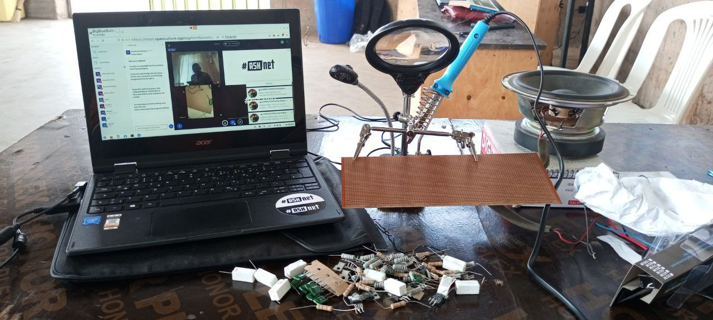
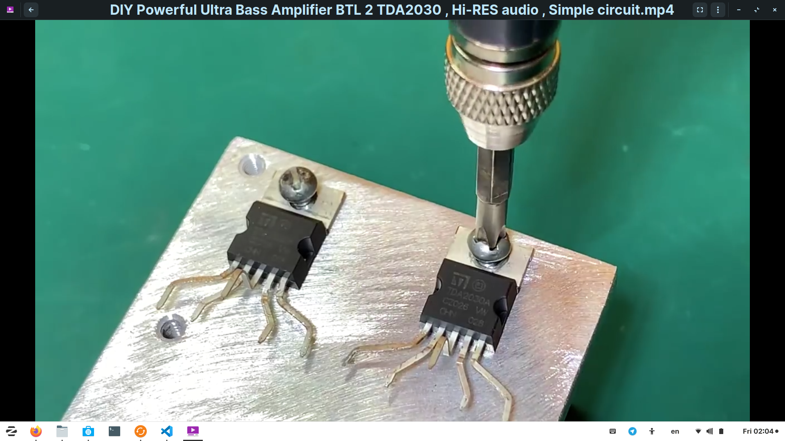
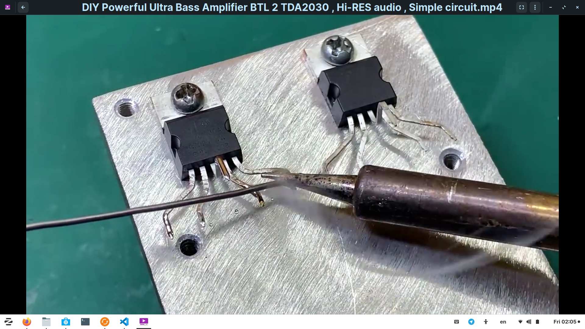
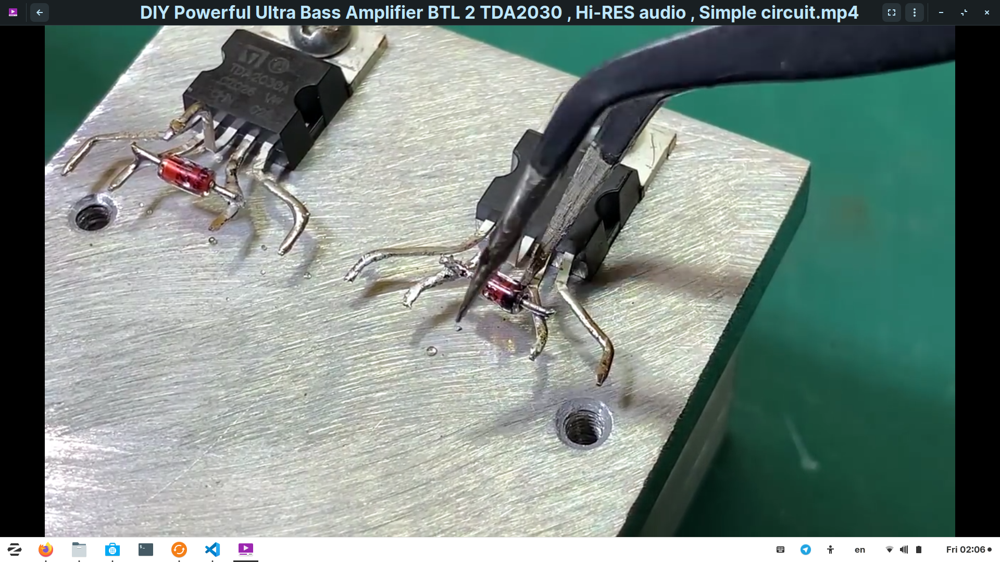
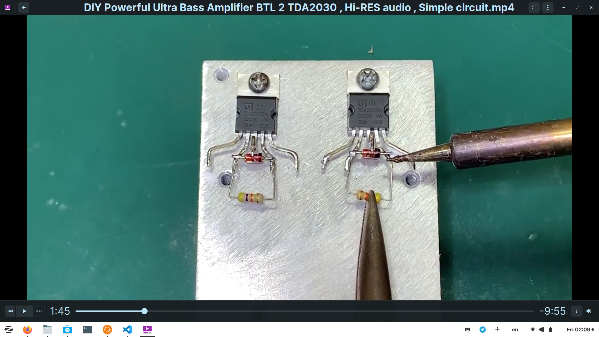
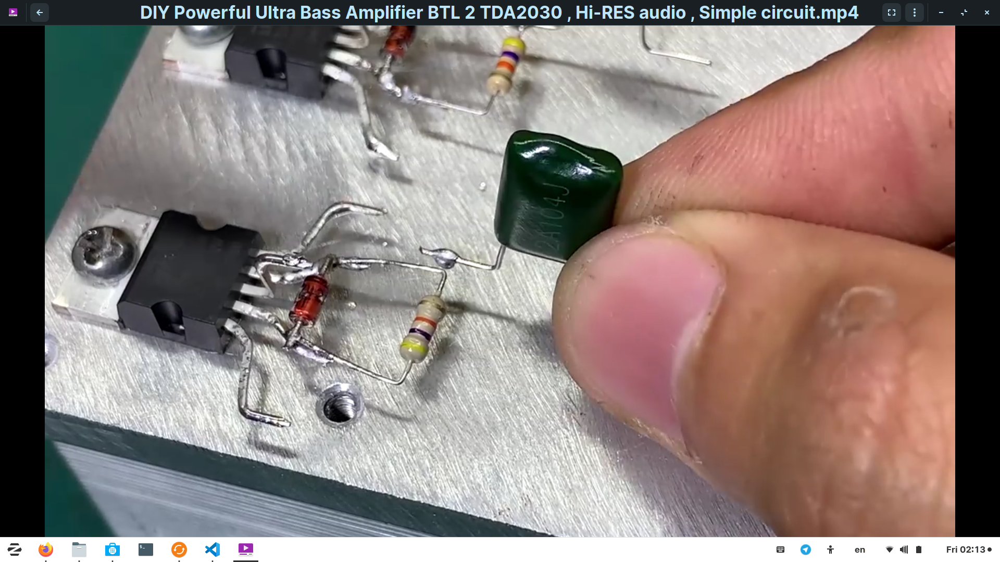
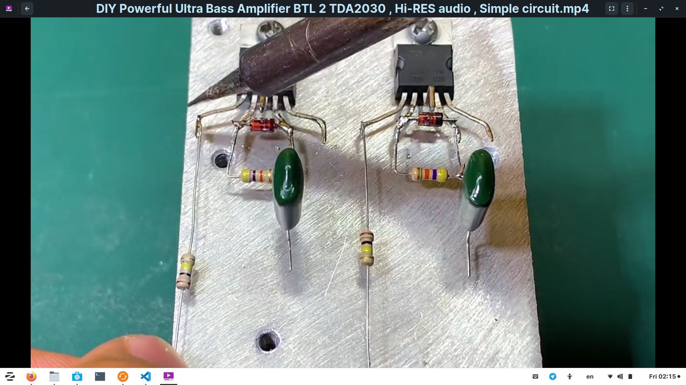

<h1>building a diy audio ultra bass amplifier</h1>

<Paragraph>The project consists of two experiements;
<li>
using two transistors TDA 2030
</li>
<li>
using one transistor TDA 2030
</li>


<h2>
Step by step procedure for experiment using two TDA 2030 transistors
</h2>

<li>
Tie the transistor TDA 2030 on the alluminium piece.
</li>

<li>
Spray it's terminals left and right and apply soldering wire on each terminal.
</li>







<li>
solder the diode 1N4148 with the negative on the second terminal of the TDA 2030 and the positive on the second terminal from the right,same procedure repeated for second diode.



<li>
solder a resistor 47k on the second terminal of TDA2030 and same applies to the second TDA2030 on the right


<li>
solder capacitor 2A104j,one on the second terminal of TDA2030 from the right and the other on the second terminal of TDA2030 also from the right


<li>
solder resistor 100k,one on the the first terminal of the first TDA2030 and the other one on the first terminal of TDA2030 from the left



<li>
solder capacitor 50v,0.1uf,the negative soldered on the second terminal of TDA2030 and the second one also the negative soldered on the second terminal of the TDA2030 from the left


Markdown is a lightweight and easy-to-use syntax for styling your writing. It includes conventions for

```markdown
Syntax highlighted code block

# Header 1
## Header 2
### Header 3

- Bulleted
- List

1. Numbered
2. List

**Bold** and _Italic_ and `Code` text

[Link](url) and 
```

For more details see [Basic writing and formatting syntax](https://docs.github.com/en/github/writing-on-github/getting-started-with-writing-and-formatting-on-github/basic-writing-and-formatting-syntax).

### Jekyll Themes

Your Pages site will use the layout and styles from the Jekyll theme you have selected in your [repository settings](https://github.com/chardso/Building-a-DIY-audio-ultra-bass-amplifier/settings/pages). The name of this theme is saved in the Jekyll `_config.yml` configuration file.

### Support or Contact

Having trouble with Pages? Check out our [documentation](https://docs.github.com/categories/github-pages-basics/) or [contact support](https://support.github.com/contact) and we’ll help you sort it out.
