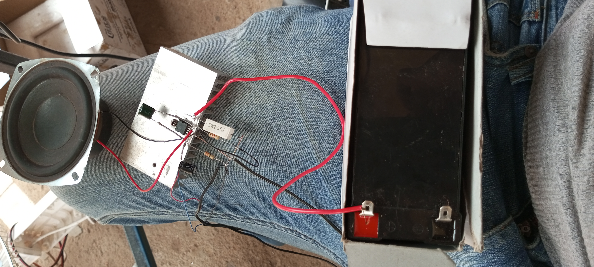

<h1>building a DIY audio ultra bass amplifier</h1>
The project consists of two experiements;

<li>
using two transistors TDA 2030

<li>
using one transistor TDA 2030

<h2>
Step by step procedure for experiments
</h2>
<h3>
Using two TDA2030 transistors
</h3>

<li>
Tie the transistor TDA 2030 on the alluminium piece.

<li>
Spray it's terminals left and right and apply soldering wire on each terminal.

<li>
solder the diode 1N4148 with the negative on the second terminal of the TDA 2030 and the positive on the second terminal from the right,same procedure repeated for second diode.

<li>
solder a resistor 47k on the second terminal of TDA2030 and same applies to the second TDA2030 on the right

<li>
solder capacitor 2A104j,one on the second terminal of TDA2030 from the right and the other on the second terminal of TDA2030 also from the right

<li>
solder resistor 100k,one on the the first terminal of the first TDA2030 and the other one on the first terminal of TDA2030 from the left

<li>
solder capacitor 50v,0.1uf,the negative soldered on the second terminal of TDA2030 and the second one also the negative soldered on the second terminal of the TDA2030 from the left

<li>
100ohm resistors,one soldered on the positive of the capacitor 50v,0.1uf and the second one on the first 2A104j capacitor
<image src="100ohmresistor.png"/>
<li>
470ohm resistors,one soldered on the positive of the capacitor 50v,0.1uf and the second one one the 2A104j capacitor

<li>
jumper wire or copper wire soldered on all resistors.
<li>
The overlapping terminals and copper wire are cut to obtain a uniform level

<li>
Diode 3A,the negative soldered on the positive of the diode 1N4148 and the positive soldered on the negative of the second diode 1N4148.

<li>
The second copper wire soldered on the first terminal of the TDA2030 from the left and the other terminal on the first terminal of the second TDA2030
<li>    
104j,630v capacitors,one soldered on the first terminal of TDA2030and second terminal soldered on the neutral terminal where the coper wire is soldered.the second 104j,630v capacitor soldered on the terminal of 2A104j capacitor and resistor 470ohms and the second terminal on the first terminal of the TDA2030 where the copper wire is soldered

<li>   
The third copper wire soldered on the neutral terminal of TDA2030 and the second terminal on the neutral terminal of the second TDA2030

<li>   
270ohm resistor soldered on the positive of the capacitor 50v,0.1uf and the other terminal on the 2A104j,first capacitor from the left.

<li>   
capacitor 25v,47uf ,the negative soldered on the jumper wire and the experiment is turned upside and the positive is left hanging

<li>   
2A102j capacitor,one terminal soldered on there side of the copper wire and the other terminal left hanging in air

<li>   
Another copper wire soldered on the hanging terminal of 2A102j capacitor and the other terminal on the second of the first TDA2030 on the second terminal from the right when the experiment is turned upside down
<li>    
cross check the contacts that may lead to short circuit

<li>    
audio line,the positive are combined together and negative also combined

<li>    
the positives are soldered on the first terminal of the TDA2030 where the 104j,630v capacitor is soldered and the negatives on the copper wire where the 2A102j capacitor is soldered

<li>
power line, negative on the second copper wire on the TDA2030 when ur expriement is upright and the positive on the first copper wire on the first terminal of the TDA2030 on ur right

<li>   
speaker loud_sound negative soldered on the negative on the negative of the 3A diode and the positive on the second terminal of the TDA2030 when the experiment is turned upside down from your left on the same point where the positive of the diode 1N4148 is soldered
  
<li>  
check for contact joints before connecting to a 12v,7AH power

<li>   
provide an audio source for example phone or any other audio system that uses a big pin.

<li>
then insert the audio line into the audio source,then play music, enjoy your ultra bass amplifier
<h2>
Experiment two
</h2>

<h3>
materials
</h3>
<li>   
capacitor 16v,470uf
<li>  
transistor TDA 2030
<li>   
alluminium shock absorber
<li>  
resistor 330n,2w
<li>  
resistor 1k,2w
<li>   
battery 12v,7AH
<li>   
power line
<li> 
audio line
<li> 
dropper 100n,5w
<li> 
speaker 20-100ohms
<h4>
procedure
</h4>
<li>   
tie TDA2030 on the alluminium shock absorber
<li>  
apply soldering wire on its terminals
<li>  
solder the negative terminal of the capacitor 16v,470uf on the first terminal of the TDA from your left
<a>link to YouTube</a>

 

         

