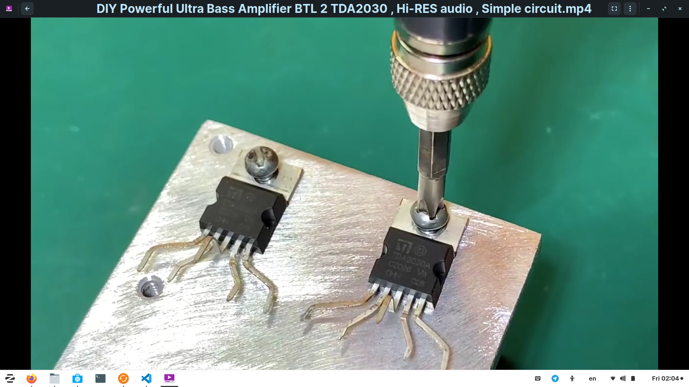
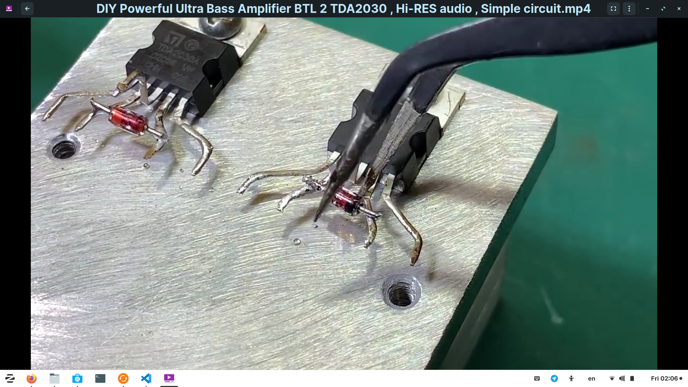

# step by step procedure of building an ultra bass amplifier experiment one
- Tie the transistor TDA 2030 on the alluminium piece.
- Spray it's terminals left and right and apply soldering wire on each terminal.
 

- solder the diode 1N4148 with the negative on the second terminal of the TDA 2030 and the positive on the second terminal from the right,same procedure repeated for second diode.

- solder a resistor 47k on the second terminal of TDA2030 and same applies to the second TDA2030 on the right

- solder capacitor 2A104j,one on the second terminal of TDA2030 from the right and the other on the second terminal of TDA2030 also from the right

- solder resistor 100k,one on the the first terminal of the first TDA2030 and the other one on the first terminal of TDA2030 from the left

- solder capacitor 50v,0.1uf,the negative soldered on the second terminal of TDA2030 and the second one also the negative soldered on the second terminal of the TDA2030 from the left

- 100ohm resistors,one soldered on the positive of the capacitor 50v,0.1uf and the second one on the first 2A104j capacitor.

- 470ohm resistors,one soldered on the positive of the capacitor 50v,0.1uf and the second one one the 2A104j capacitor

- jumper wire or copper wire soldered on all resistors.

